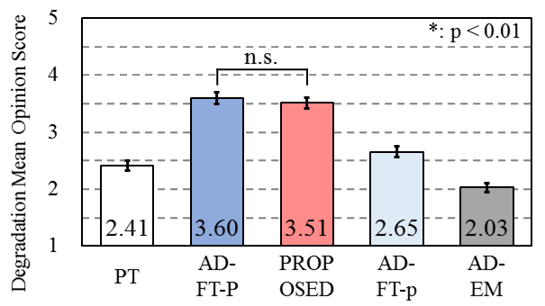

# Demo of speech sample

- Semi-supervised speaker adaptation for end-to-end speech synthesis with pretrained models
- Katsuki Inoue, Sunao Hara, Masanobu Abe, Tomoki Hayashi, Ryuichi Yamamoto, Shinji Watanabe

## Abstract 

Recently, end-to-end text-to-speech (TTS) models have achieved a remarkable performance, however, requiring a large amount of paired text and speech data for training.
On the other hand, we can easily collect unpaired dozen minutes of speech recordings for a target speaker without corresponding text data.
To make use of such accessible data, the proposed method leverages the recent great success of state-of-the-art end-to-end automatic speech recognition (ASR) systems and obtains corresponding transcriptions from pretrained ASR models.
Although these models could only provide text output instead of intermediate linguistic features like phonemes, end-to-end TTS can be well trained with such raw text data directly.
Thus, **the proposed method can greatly simplify a speaker adaptation pipeline by consistently employing end-to-end ASR/TTS ecosystems.**
The experimental results show that our proposed method achieved comparable performance to a paired data adaptation method in terms of subjective speaker similarity and objective cepstral distance measures.

## Model

All TTS models have Transformer [1] architecture.

- PT : the pretrained model
- **PROPOSED : the adapted model based on fine-tuning with unpaired speech data**
- AD-FT-P : the adapted model based on fine-tuning with paired data (speech, texts)
- AD-FT-p : the adapted model based on fine-tuning with half size of paired data (speech, texts)
- AD-EM : the adapted model based on feature embedding (x-vector [2])

## Sample

DMOS results of speaker similarity  
 

### FemaleA  

    Marie clasped her hands and started up from her seat.

| Model | Speech |  
| --- | --- |  
| Target speaker (reference) | <audio src="wav/ground-truth/237_134500_000036_000000.wav" controls></audio> |  
| PT | <audio src="wav/pretrained/237_134500_000036_000000.wav" controls></audio> |  
| PROPOSED | <audio src="wav/adapt-ft-unpair/237_134500_000036_000000.wav" controls></audio> |  
| AD-FT-P | <audio src="wav/adapt-ft-pair/237_134500_000036_000000.wav" controls></audio> |  
| AD-FT-p | <audio src="wav/adapt-ft-pair-half/237_134500_000036_000000.wav" controls></audio> |  
| AD-EM | <audio src="wav/adapt-em/237_134500_000036_000000.wav" controls></audio> |  

### FemaleB  

    Marie clasped her hands and started up from her seat.

| Model | Speech |  
| --- | --- |  
| Target speaker (reference) | <audio src="wav/ground-truth/4446_2275_000046_000001.wav" controls></audio> |  
| PT | <audio src="wav/pretrained/4446_2275_000046_000001.wav" controls></audio> |  
| PROPOSED | <audio src="wav/adapt-ft-unpair/4446_2275_000046_000001.wav" controls></audio> |  
| AD-FT-P | <audio src="wav/adapt-ft-pair/4446_2275_000046_000001.wav" controls></audio> |  
| AD-FT-p | <audio src="wav/adapt-ft-pair-half/4446_2275_000046_000001.wav" controls></audio> |  
| AD-EM | <audio src="wav/adapt-em/4446_2275_000046_000001.wav" controls></audio> |  

### FemaleC  

## Reference

- [1]: A. Vaswani, N. Shazeer, N. Parmar, J. Uszkoreit, L. Jones, A. N. Gomez, Ł. Kaiser, and I. Polosukhin, “Attention is allyou need,”  in Advances in neural information processing sys-tems, 2017, pp. 5998–6008.
- [2]: D. Snyder, D. Garcia-Romero, G. Sell, D. Povey, and S. Khu-danpur, “X-vectors: Robust DNN embeddings for speaker recognition,” in Proc. of ICASSP, 2018, pp. 5329–5333.
